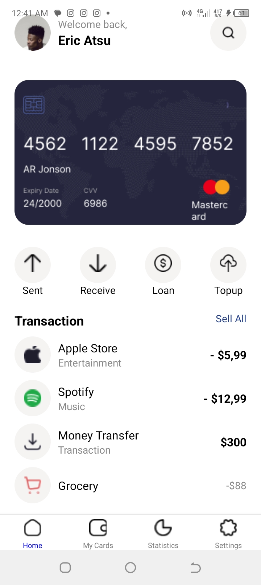
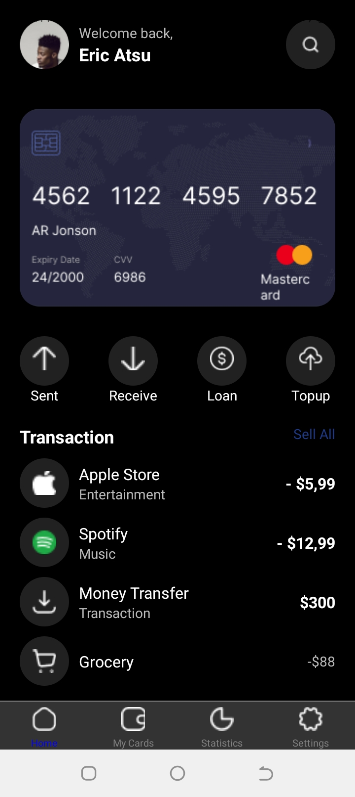
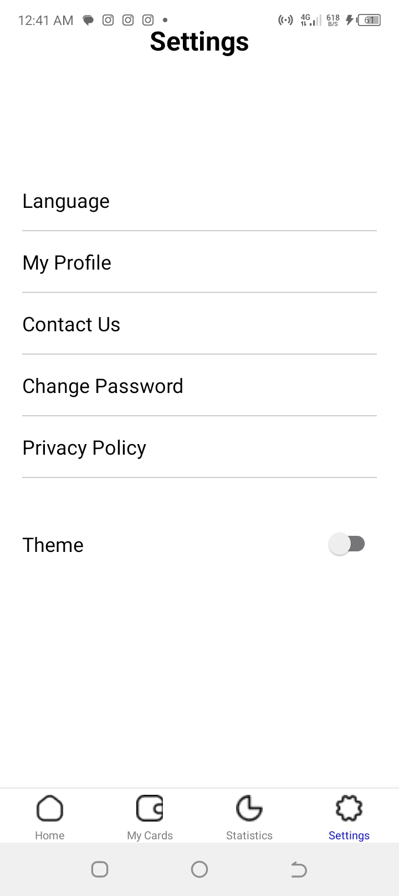
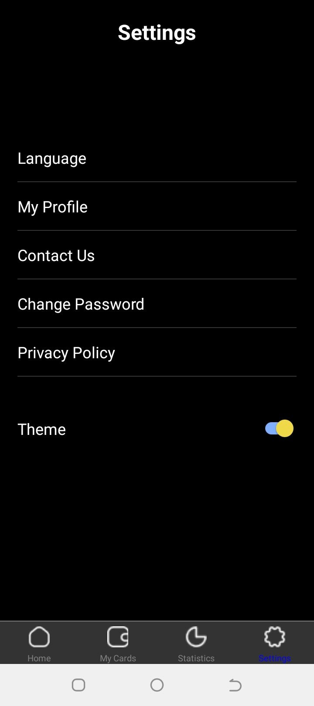

# rn-assignment5-1014393

# MobileApp

## Description

This project is a mobile application built with React Native. It features a Home screen and a Settings screen with the ability to switch between light and dark themes.

## Features

- Home screen
- Settings screen
- Theme switcher (light/dark)

## Screenshots

## Installation

1. Clone the repository.
2. Run `npm install` to install dependencies.
3. Run `npx react-native run-android` or `npx react-native run-ios` to start the application.

## Usage

- Navigate between Home and Settings screens using the bottom tab navigator.
- Switch themes using the button on the Settings screen.

## License

This project is licensed under the MIT License.
